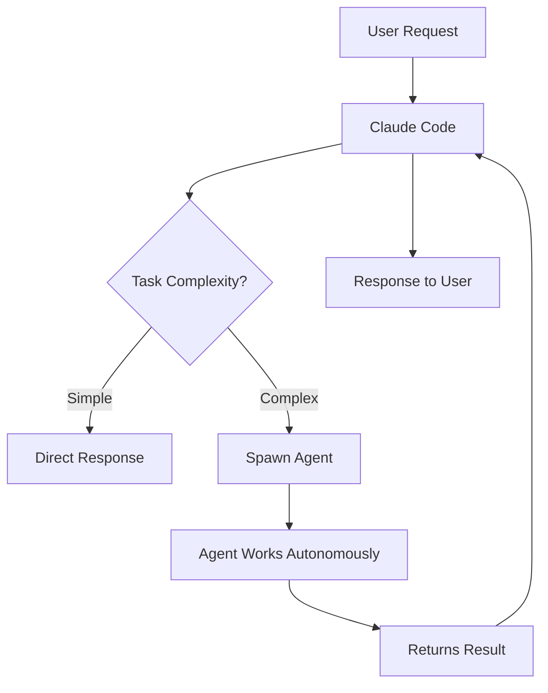
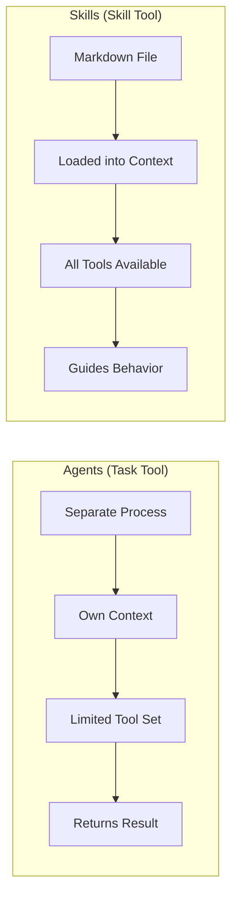

If you've been using Claude Code (Anthropic's CLI tool), you've probably encountered both "agents" and "skills" in the interface. At first glance, they might seem similar - both extend what Claude can do. But they serve fundamentally different purposes, and understanding when to use each will make you significantly more effective.

Let me break down exactly what each one does, how they differ architecturally, and when you should reach for one over the other.

## What are Claude Code Agents?

Agents in Claude Code are **autonomous subprocesses** that handle complex, multi-step tasks. When you invoke an agent, Claude Code spawns a separate process with its own context and a specific set of tools tailored to that agent's purpose.

You interact with agents through the **Task tool**, specifying which type of agent you need:

```ts filename="task-tool-example.ts"
// Conceptual example of how the Task tool works
// (This is invoked internally by Claude Code, not directly by users)

Task({
  subagent_type: "Explore",
  prompt: "Find all files related to user authentication",
  description: "Search auth files"
})
```

### Available Agent Types

Claude Code provides several specialized agents:

| Agent Type | Purpose | Tools Available |
|------------|---------|-----------------|
| **Explore** | Fast codebase exploration | Glob, Grep, Read (no editing) |
| **Plan** | Design implementation strategies | All read tools, no write tools |
| **Bash** | Command execution | Bash only |
| **general-purpose** | Complex multi-step tasks | All tools |

Each agent runs autonomously - it receives a task, works through it using its available tools, and returns a result. The key insight is that agents are **stateless between invocations**. Each time you spawn an agent, it starts fresh.

### When Agents Get Used

Claude Code uses agents automatically when appropriate. For example:

- When you ask "where is error handling done in this project?", Claude might spawn an **Explore agent** to search the codebase
- When you say "plan out how to add authentication", Claude might use a **Plan agent** to design the approach
- When you need multiple independent tasks done in parallel, Claude can spawn multiple agents simultaneously



## What are Claude Code Skills?

Skills are something completely different. A skill is a **markdown file containing instructions** that Claude loads and follows. Think of skills as runbooks or playbooks - they define *how* Claude should approach a specific type of task.

### Skill File Structure

A skill is just a markdown file with frontmatter:

```md filename="my-custom-skill.md"
---
name: code-review
description: Use when reviewing pull requests or code changes
---

# Code Review Process

When reviewing code, follow these steps:

1. First, understand the context - read the PR description
2. Check for breaking changes
3. Review test coverage
4. Look for security issues
5. Verify coding standards

## Checklist

- [ ] Tests pass
- [ ] No console.logs left behind
- [ ] Error handling is appropriate
- [ ] Types are correct
```

When you invoke this skill, Claude reads the file and follows those instructions in the current conversation. The skill content becomes part of Claude's context.

### How Skills are Invoked

You invoke skills using the **Skill tool** or by typing a slash command:

```bash
# Using slash command
/code-review

# Claude then loads the skill and follows its instructions
```

Skills can be:
- **Built-in** - Shipped with Claude Code
- **Custom** - Created by you in your project or globally

### Key Characteristics of Skills

1. **They're instructions, not processes** - Skills don't spawn separate processes; they add context to the current conversation
2. **They persist in the conversation** - Once loaded, the skill's instructions guide Claude's behavior
3. **They're composable** - Multiple skills can be active at once
4. **They're customizable** - You can write your own skills for your team's workflows

## Key Differences: Architecture Comparison

Here's where things get interesting. Let me break down the fundamental architectural differences:



| Aspect | Agents | Skills |
|--------|--------|--------|
| **What it is** | Subprocess with own context | Instructions loaded into current context |
| **Execution** | Runs autonomously | Guides Claude's behavior |
| **State** | Stateless between calls | Persists in conversation |
| **Tools** | Limited set per agent type | All tools available |
| **Best for** | Parallel tasks, isolated work | Workflows, standards, processes |
| **Customization** | Cannot create new agent types | Can create custom skills |

## When to Use Agents

Use agents (via the Task tool) when:

1. **You need parallel execution** - Multiple independent searches or tasks
2. **The task is self-contained** - It can be fully described upfront and doesn't need back-and-forth
3. **You want isolation** - The subtask shouldn't affect the main conversation context
4. **Speed matters for exploration** - The Explore agent is optimized for fast codebase searches

**Example scenario**: You need to find all usages of a deprecated API across a large codebase while simultaneously checking the git history for when it was introduced.

```
Claude spawns two agents in parallel:
1. Explore agent → searches for API usages
2. Bash agent → runs git log commands

Both return results independently
```

## When to Use Skills

Use skills when:

1. **You have a repeatable workflow** - Code reviews, commit messages, testing procedures
2. **You want to enforce standards** - Team coding guidelines, documentation requirements
3. **The process needs interaction** - Skills can guide multi-turn conversations
4. **You want to customize Claude's behavior** - Project-specific conventions

**Example scenario**: Your team has specific code review criteria that should be checked every time.

```md filename=".claude/skills/team-review.md"
---
name: team-review
description: Our team's code review checklist
---

# Review Checklist

Before approving, verify:
- [ ] Follows our naming conventions (camelCase for functions)
- [ ] Has integration tests for new endpoints
- [ ] Updates the changelog
- [ ] No TODO comments without issue links
```

Now whenever someone types `/team-review`, Claude follows your team's exact process.

## Creating Your Own Skills

One of the most powerful aspects of skills is that you can create your own. Here's a practical example:

```md filename=".claude/skills/debug-workflow.md"
---
name: debug
description: Systematic debugging approach for our Node.js services
---

# Debugging Workflow

When debugging an issue:

## 1. Reproduce First
- Get exact steps to reproduce
- Note the environment (dev/staging/prod)
- Capture any error messages verbatim

## 2. Check the Usual Suspects
- Recent deployments (last 24h)
- Database connection issues
- Third-party API status

## 3. Isolate
- Add logging around the suspected area
- Check if it's data-dependent
- Verify it's not environment-specific

## 4. Fix and Verify
- Write a test that fails before the fix
- Implement the minimal fix
- Verify the test passes
- Check for regressions
```

This skill encodes your team's debugging methodology. New team members can use it to follow best practices automatically.

## Practical Examples

### Example 1: Codebase Exploration (Agent)

When you ask Claude Code something like:

> "Find all the places where we handle authentication errors"

Claude might spawn an Explore agent:

```
Task(
  subagent_type: "Explore",
  prompt: "Search for authentication error handling...",
  thoroughness: "medium"
)
```

The agent searches independently and returns results.

### Example 2: Enforcing PR Standards (Skill)

Create a skill for your PR process:

```md filename=".claude/skills/pr-prep.md"
---
name: pr-prep
description: Prepare changes for a pull request
---

Before creating a PR, ensure:

1. Run the test suite: `npm test`
2. Run the linter: `npm run lint`
3. Update types if needed: `npm run typecheck`
4. Write a clear commit message following conventional commits
5. Update CHANGELOG.md if this is a user-facing change
```

Now `/pr-prep` guides you through your team's PR preparation process.

## Summary

The distinction is simple once you see it:

- **Agents** = Autonomous workers that execute tasks and return results
- **Skills** = Instructions that guide how Claude approaches tasks

Use agents when you need parallel, isolated task execution. Use skills when you want to encode workflows, standards, or processes that Claude should follow.

Both are powerful in their own way, and the best Claude Code users know when to reach for each one.

Until next time, happy coding!
– Patricio Marroquin
