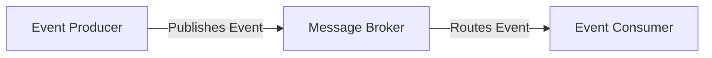

Event-driven architecture (EDA) is rapidly becoming the backbone of many modern, scalable applications, especially when it comes to building APIs that need to handle high volumes of requests without breaking a sweat. NestJS, with its robust, scalable framework and first-class support for event-driven communication, stands out as a compelling choice for developers. This article dives into the nuts and bolts of creating high-throughput event-driven APIs using NestJS, leveraging the power of message brokers like Kafka or RabbitMQ. We'll explore practical strategies for maximizing throughput, ensuring reliability, and simplifying maintenance to keep your APIs running smoothly under any load.

## Basics of Event-Driven Architecture in Backend APIs


At its core, event-driven architecture is a design paradigm where services communicate through events - significant changes in state that are broadcasted by a producer and received by one or more consumers. This decouples service dependencies, allowing for highly scalable, flexible systems. 



In the context of NestJS, this translates to services that can emit and listen for events, processing them asynchronously. This not only enhances performance by preventing bottlenecks but also improves the system's fault tolerance and responsiveness.

## Setting up NestJS with Kafka or RabbitMQ

Choosing the right message broker is crucial for your event-driven architecture. Kafka and RabbitMQ are both excellent choices, with Kafka being ideal for high-throughput scenarios and RabbitMQ offering more flexible routing options.

### Kafka Setup

To integrate Kafka with NestJS, you'll need to use the `@nestjs/microservices` package which simplifies the setup. Here's a basic producer and consumer setup:

```ts filename="kafka-setup.ts"
import { ClientKafka, Transport } from '@nestjs/microservices';

// Kafka Producer Setup
const kafkaProducer = new ClientKafka({
  transport: Transport.KAFKA,
  options: {
    client: {
      brokers: ['localhost:9092'],
    },
    consumer: {
      groupId: 'my-consumer-' + Math.random(),
    },
  },
});

// Kafka Consumer Setup
const kafkaConsumer = new ClientKafka({
  transport: Transport.KAFKA,
  options: {
    client: {
      brokers: ['localhost:9092'],
    },
    consumer: {
      groupId: 'my-group',
    },
  },
});
```

This snippet demonstrates how to configure both a Kafka producer and consumer within a NestJS application. The `groupId` for the consumer is particularly important for ensuring that messages are correctly distributed among multiple instances of your service.

## Best Practices for Message Handling and Retries

Handling messages efficiently and reliably in an event-driven system is critical. Here are some best practices:

- **Idempotency**: Ensure that your message handlers are idempotent. This means a message can be processed multiple times without causing unintended effects.
- **Acknowledgment and Retries**: Implement acknowledgment mechanisms to confirm successful message processing. Use retries with exponential backoff for handling temporary failures.

### Graceful Error Handling in Async Message Processing

When processing messages asynchronously, it's vital to have robust error handling mechanisms in place. Here's an example of graceful error handling in a Kafka message consumer:

```ts filename="async-error-handling.ts"
async function handleMessage(message: any) {
  try {
    // Process the message
    console.log('Processing message:', message.value);
    // Acknowledge the message
    await acknowledgeMessage(message);
  } catch (error) {
    console.error('Failed to process message:', error);
    // Retry or dead-letter the message
    await handleError(message, error);
  }
}
```

This function attempts to process a message, acknowledges it upon success, and handles errors gracefully, possibly retrying or moving the message to a dead-letter queue for further investigation.

## Error Handling and Observability

In an event-driven system, monitoring and observability are crucial for identifying and resolving issues quickly. Implement comprehensive logging, tracing, and monitoring to keep tabs on your system's health and performance.

## Scaling Tips and Pitfalls to Avoid

Scaling an event-driven system involves more than just adding more instances. Keep these tips in mind:

- **Partitioning**: Use partitioning in your message broker to distribute the load evenly across consumers.
- **Resource Management**: Be mindful of resource usage, including connections and memory, to prevent bottlenecks.
- **Dependency Awareness**: While EDA reduces direct dependencies, be aware of indirect dependencies that can affect scaling.

### Pitfalls to Avoid

- **Over-Partitioning**: While partitioning can help with scalability, too many partitions can lead to management complexity and increased overhead.
- **Ignoring Back Pressure**: Implement back-pressure mechanisms to prevent overwhelming your system during spikes in event production.

Building high-throughput event-driven APIs with NestJS and message brokers like Kafka or RabbitMQ can significantly enhance the scalability and performance of your backend systems. By following the best practices and tips outlined in this article, you can design robust, efficient APIs that stand up to the demands of high load, ensuring smooth and reliable operation.

Until next time, happy coding 👨‍💻  
– Patricio Marroquin 💜
