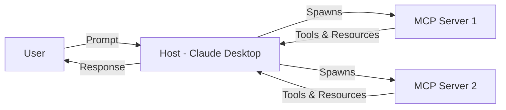

With the rapid advancement of AI technologies, the integration between AI assistants and external tools has become increasingly crucial. Enter the Model Context Protocol (MCP), a game-changer in how we connect AI like Claude and ChatGPT to our custom tools and data sources. In this tutorial, we'll dive into the exciting world of MCP, guiding you through building your very first MCP server. By the end, you'll have a functional server that any major AI assistant can tap into, truly unlocking the potential of AI in your projects.

## What is MCP and Why It Matters in 2026

MCP, or Model Context Protocol, has emerged as the de-facto standard for interfacing AI agents with external resources. Adopted by leading AI developers such as Anthropic, OpenAI, and Google, MCP has seen a staggering 97M+ monthly SDK downloads. But why has it gained such traction?

- **Universal Compatibility**: MCP ensures AI models like Claude and ChatGPT can interact with a wide range of tools and services without bespoke integration work.
- **Security and Control**: It provides a secure and standardized way to manage how AI agents access data, crucial in today’s privacy-conscious world.
- **Enhanced AI Utility**: By connecting AI assistants to real-world data and tools, MCP significantly expands their utility beyond mere text generation.

## MCP Architecture: Hosts, Clients, Servers, and the Protocol Flow

MCP follows a client-server architecture where the AI application is the **client** and your code is the **server**:



- **Host**: The AI application (Claude Desktop, VS Code, Cursor) that runs MCP clients
- **Client**: The MCP protocol handler inside the host that communicates with servers
- **Server**: Your code that exposes tools and resources via stdio

The host spawns your server as a subprocess and communicates via JSON-RPC over stdin/stdout. This means:
- No network configuration needed
- Servers run with the same permissions as the host
- Multiple servers can run simultaneously

## Setting Up Your TypeScript MCP Server Project with the Official SDK

Let's dive into the code. First, ensure you have Node.js 18+ installed. Create a new project and add the MCP SDK:

```bash
mkdir my-mcp-server && cd my-mcp-server
npm init -y
npm install @modelcontextprotocol/sdk zod
npm install -D typescript @types/node
npx tsc --init
```

**Important**: MCP servers communicate via stdio (standard input/output), not HTTP. This is how AI hosts like Claude Desktop spawn and communicate with your server.

Now, let's create a basic MCP server:

```ts filename="src/index.ts"
import { Server } from "@modelcontextprotocol/sdk/server/index.js";
import { StdioServerTransport } from "@modelcontextprotocol/sdk/server/stdio.js";

const server = new Server(
  {
    name: "my-first-mcp-server",
    version: "1.0.0",
  },
  {
    capabilities: {
      tools: {},
    },
  }
);

async function main() {
  const transport = new StdioServerTransport();
  await server.connect(transport);
  console.error("MCP Server running on stdio");
}

main().catch(console.error);
```

Note: We use `console.error` for logging since `stdout` is reserved for MCP protocol messages.

## Implementing Your First Tool: A Simple Calculator Example

An MCP server becomes truly useful when it provides tools. Tools are defined with a name, description, and JSON Schema for input validation. Let's add a calculator tool:

```ts filename="src/index.ts"
import { Server } from "@modelcontextprotocol/sdk/server/index.js";
import { StdioServerTransport } from "@modelcontextprotocol/sdk/server/stdio.js";
import {
  CallToolRequestSchema,
  ListToolsRequestSchema,
} from "@modelcontextprotocol/sdk/types.js";

const server = new Server(
  { name: "calculator-server", version: "1.0.0" },
  { capabilities: { tools: {} } }
);

// List available tools
server.setRequestHandler(ListToolsRequestSchema, async () => ({
  tools: [
    {
      name: "calculate",
      description: "Perform basic arithmetic operations",
      inputSchema: {
        type: "object",
        properties: {
          operation: {
            type: "string",
            enum: ["add", "subtract", "multiply", "divide"],
            description: "The operation to perform",
          },
          a: { type: "number", description: "First operand" },
          b: { type: "number", description: "Second operand" },
        },
        required: ["operation", "a", "b"],
      },
    },
  ],
}));

// Handle tool calls
server.setRequestHandler(CallToolRequestSchema, async (request) => {
  if (request.params.name === "calculate") {
    const { operation, a, b } = request.params.arguments as {
      operation: string;
      a: number;
      b: number;
    };

    let result: number;
    switch (operation) {
      case "add": result = a + b; break;
      case "subtract": result = a - b; break;
      case "multiply": result = a * b; break;
      case "divide": result = a / b; break;
      default: throw new Error(`Unknown operation: ${operation}`);
    }

    return { content: [{ type: "text", text: `Result: ${result}` }] };
  }

  throw new Error(`Unknown tool: ${request.params.name}`);
});

async function main() {
  const transport = new StdioServerTransport();
  await server.connect(transport);
}

main().catch(console.error);
```

The `inputSchema` uses JSON Schema to define what arguments your tool accepts. The AI assistant uses this schema to understand how to call your tool correctly.

## Adding Resources: Exposing Data to AI Assistants

Besides tools (which perform actions), MCP servers can expose **resources** (data that AI can read). Resources have URIs and return content:

```ts filename="src/index.ts"
import {
  ListResourcesRequestSchema,
  ReadResourceRequestSchema,
} from "@modelcontextprotocol/sdk/types.js";

// Add resources capability
const server = new Server(
  { name: "my-server", version: "1.0.0" },
  { capabilities: { tools: {}, resources: {} } }
);

// List available resources
server.setRequestHandler(ListResourcesRequestSchema, async () => ({
  resources: [
    {
      uri: "config://app/settings",
      name: "Application Settings",
      description: "Current app configuration",
      mimeType: "application/json",
    },
  ],
}));

// Handle resource reads
server.setRequestHandler(ReadResourceRequestSchema, async (request) => {
  if (request.params.uri === "config://app/settings") {
    return {
      contents: [
        {
          uri: request.params.uri,
          mimeType: "application/json",
          text: JSON.stringify({ theme: "dark", language: "en" }),
        },
      ],
    };
  }

  throw new Error(`Unknown resource: ${request.params.uri}`);
});
```

Resources enable AI assistants to pull in context dynamically — your database schemas, config files, API documentation, or any data that helps the AI understand your system.

## Testing Your Server with Claude Desktop and VS Code

First, compile your TypeScript and make it executable:

```bash
npx tsc
chmod +x dist/index.js
```

Add a shebang to your compiled JS file or create a wrapper script. Then configure Claude Desktop by editing `claude_desktop_config.json`:

**macOS**: `~/Library/Application Support/Claude/claude_desktop_config.json`
**Windows**: `%APPDATA%\Claude\claude_desktop_config.json`

```json filename="claude_desktop_config.json"
{
  "mcpServers": {
    "calculator": {
      "command": "node",
      "args": ["/absolute/path/to/my-mcp-server/dist/index.js"]
    }
  }
}
```

Restart Claude Desktop, and your server will appear in the tools list. You can now ask Claude: "Use the calculator to add 42 and 17."

For VS Code with the Claude extension, the configuration is similar — check your extension settings for MCP server configuration.

**Debugging tip**: Since MCP uses stdio, you can test your server manually:

```bash
echo '{"jsonrpc":"2.0","id":1,"method":"tools/list"}' | node dist/index.js
```

## Registering Your Server in the MCP Registry

Once your server is tested and ready, consider registering it in the MCP Registry. This step is crucial for wider adoption and discoverability. Registration typically involves providing details about your server and the tools or resources it offers.

## Security Considerations and Best Practices

Building MCP services comes with responsibility. Here are key security best practices:

- **Authentication and Authorization**: Implement robust auth mechanisms to control access to your MCP server.
- **Input Validation**: Always validate inputs to your tools to avoid injection attacks.
- **Data Protection**: When handling sensitive data, ensure it's encrypted in transit and at rest.

Security is a moving target, so staying updated with best practices and vulnerabilities in the MCP ecosystem is crucial.

Until next time, happy coding 👨‍💻  
– Patricio Marroquin 💜
