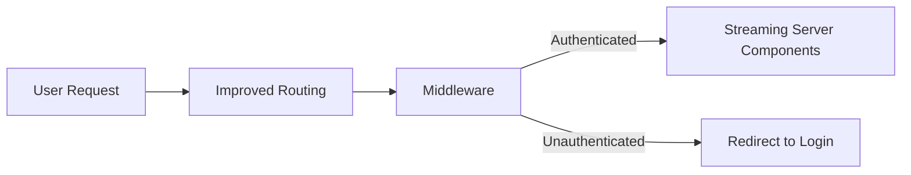

With the recent launch of Next.js 15, the web development community has been abuzz with discussions about the new features, performance improvements, and, unavoidably, the breaking changes it brings. As someone who's been knee-deep in Next.js for projects of all sizes, I've taken a closer look at what's really new under the hood and, more importantly, what these changes mean for you as a developer. Let’s cut through the hype and explore the changes that will actually impact your work.

## Overview of Next.js 15 main release notes

Next.js 15 introduces a slew of updates aimed at improving development experience, runtime performance, and the overall efficiency of applications built with the framework. Key highlights include revamped routing capabilities, enhanced middleware support, server components and streaming enhancements, alongside various performance optimizations. While these updates sound promising, understanding their practical implications is crucial for leveraging their full potential.

## Improved routing and middleware updates

### Routing Reimagined

The routing system in Next.js has always been a defining feature, but with version 15, it’s taken a leap forward. The introduction of file-system-based dynamic routes adds a layer of flexibility that wasn’t there before.

**Before:**
```jsx
// pages/posts/[id].jsx
// Static routing, manual parsing needed for dynamic segments
```

**After:**
```jsx
// pages/posts/$id.jsx
// Enhanced dynamic routing, automatic parsing of dynamic segments
```

This change simplifies the process of creating dynamic routes, making your code cleaner and more intuitive.

### Middleware Magic

Middleware functions have been supercharged in Next.js 15, offering more control over the request-response lifecycle. This is particularly useful for tasks like authentication, logging, and custom redirects.

```js filename="middleware.js"
// Using the new middleware API
export function middleware(request) {
  return new Response("Hello, world!");
}
```

This snippet showcases the simplicity of intercepting requests and sending custom responses directly within the middleware, a feature that enhances both flexibility and power in handling server-side logic.


*Image by James Wiseman on Unsplash*

## Changes in server components and streaming

Streamlining the user experience with faster load times and interactive pages is at the heart of Next.js 15’s enhancements. Server components and streaming are pivotal in achieving this.

### Streaming Server Components

Implementing streaming with server components allows chunks of your application to be sent to the client as they are rendered, rather than waiting for the entire page to load. This incremental delivery can significantly improve performance, especially for content-heavy pages.

```jsx
// Implementing streaming server components
// Note: This is a conceptual demonstration; check official docs for exact syntax.
function MyComponent() {
  const data = useServerData('/api/data');
  return (
    <div>
      {data.map(item => (
        <p key={item.id}>{item.content}</p>
      ))}
    </div>
  );
}
```

This example, while simplified, illustrates the shift towards a more dynamic and responsive application architecture, emphasizing the importance of streamlining content delivery to enhance user experience.

## Migration tips and gotchas

Transitioning to Next.js 15 requires careful consideration, especially regarding the breaking changes. Here are some tips to ensure a smooth migration:

- Review routing changes closely, as the shift to the new dynamic route patterns may affect existing URLs.
- Test middleware thoroughly, given its broader capabilities and the potential impact on application logic.
- Experiment with server components and streaming in isolated environments before full-scale implementation to understand their behavior and performance benefits.

## Performance gains and benchmarks

Performance is a key focus of Next.js 15, with benchmarks indicating improvements in both build times and runtime efficiency. These gains result from optimizations in the framework's core, such as better JavaScript bundling and enhanced data fetching mechanisms, which collectively contribute to a snappier development experience and faster end-user interactions.

## How this shifts your app architecture


*Image by Mathias Reding on Unsplash*


The enhancements in Next.js 15 encourage a more modular, efficient approach to building web applications. The improved routing system simplifies dynamic content delivery, middleware updates offer more control over the request-response cycle, and streaming server components push the envelope on performance and interactivity.



This diagram encapsulates the streamlined flow introduced by Next.js 15, highlighting the seamless integration of routing, middleware, and server components to deliver a robust user experience.

Until next time, happy coding 👨‍💻  
– Patricio Marroquin 💜
