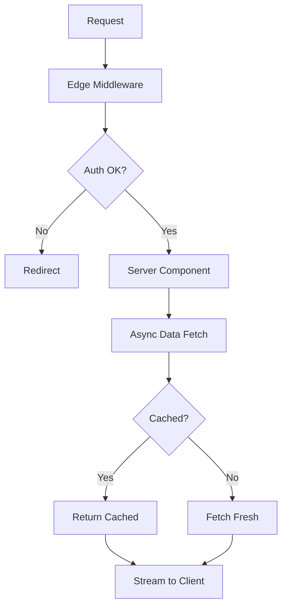

With the recent launch of Next.js 15, the web development community has been abuzz with discussions about the new features, performance improvements, and, unavoidably, the breaking changes it brings. As someone who's been knee-deep in Next.js for projects of all sizes, I've taken a closer look at what's really new under the hood and, more importantly, what these changes mean for you as a developer. Let’s cut through the hype and explore the changes that will actually impact your work.

## Overview of Next.js 15 main release notes

Next.js 15 is a significant release with several breaking changes. Here's what actually matters:

| Feature | Impact | Breaking? |
|---------|--------|-----------|
| Turbopack stable (dev) | 50%+ faster dev server | No |
| React 19 support | New hooks, better hydration | No |
| Async Request APIs | `params`, `cookies()`, `headers()` are now async | **Yes** |
| Caching changes | `fetch` no longer cached by default | **Yes** |
| `next/form` | Progressive enhancement for forms | No |
| Partial Prerendering | Hybrid static/dynamic rendering | Experimental |

Let's dig into each of these.

## Turbopack is finally stable

After years of development, Turbopack is now stable for the dev server. This is the Rust-based bundler that replaces Webpack during development.

```bash
# Enable Turbopack (now the default in next dev)
next dev --turbo
```

**What you'll notice:**
- **76% faster** initial compile on large apps
- **96% faster** Fast Refresh updates
- Significantly lower memory usage

Turbopack is only for dev mode — production builds still use Webpack. But if you've been holding off, now's the time to enable it.

## React 19 support

Next.js 15 ships with React 19 support, bringing several improvements:

```tsx filename="app/actions.ts"
'use server';

// Server Actions are now stable
export async function submitForm(formData: FormData) {
  const email = formData.get('email');
  // Process on the server
  return { success: true };
}
```

```tsx filename="app/form/page.tsx"
import { useActionState } from 'react';
import { submitForm } from './actions';

export default function FormPage() {
  const [state, action, isPending] = useActionState(submitForm, null);

  return (
    <form action={action}>
      <input name="email" type="email" disabled={isPending} />
      <button type="submit" disabled={isPending}>
        {isPending ? 'Submitting...' : 'Submit'}
      </button>
    </form>
  );
}
```

The new `useActionState` hook (formerly `useFormState`) gives you pending states without manual `useState` management.

## Improved routing and middleware updates

### Routing Reimagined

Next.js 15 continues the shift toward the App Router as the recommended approach. If you're still on the Pages Router, now's a good time to migrate.

**Pages Router (legacy):**
```jsx filename="pages/posts/[id].jsx"
// Dynamic route with useRouter for params
import { useRouter } from 'next/router';

export default function Post() {
  const router = useRouter();
  const { id } = router.query;
  return <div>Post: {id}</div>;
}
```

**App Router (recommended):**
```tsx filename="app/posts/[id]/page.tsx"
// Dynamic route with typed params - cleaner and type-safe
interface Props {
  params: Promise<{ id: string }>;
}

export default async function Post({ params }: Props) {
  const { id } = await params;
  return <div>Post: {id}</div>;
}
```

The App Router's `params` are now async in Next.js 15, requiring `await` before accessing them. This aligns with the framework's push toward async Server Components.

### Middleware Improvements

Next.js 15 brings stability improvements to middleware. The API remains largely the same, but now with better error handling and geo/IP detection built-in.

```ts filename="middleware.ts"
import { NextResponse } from 'next/server';
import type { NextRequest } from 'next/server';

export function middleware(request: NextRequest) {
  // Check auth token
  const token = request.cookies.get('session');

  if (!token && request.nextUrl.pathname.startsWith('/dashboard')) {
    return NextResponse.redirect(new URL('/login', request.url));
  }

  // Add custom headers
  const response = NextResponse.next();
  response.headers.set('x-request-id', crypto.randomUUID());
  return response;
}

export const config = {
  matcher: ['/dashboard/:path*', '/api/:path*'],
};
```

The `matcher` config is crucial — it prevents middleware from running on static assets, which was a common performance pitfall in earlier versions.

## Changes in server components and streaming

Streamlining the user experience with faster load times and interactive pages is at the heart of Next.js 15’s enhancements. Server components and streaming are pivotal in achieving this.

### Streaming Server Components

Server Components in Next.js 15 stream by default when using the App Router. Combined with `loading.tsx` and `Suspense`, you can show content progressively as it becomes available.

```tsx filename="app/posts/page.tsx"
import { Suspense } from 'react';

async function PostList() {
  // This fetch happens on the server, data streams to client
  const posts = await fetch('https://api.example.com/posts', {
    next: { revalidate: 60 }, // Cache for 60 seconds
  }).then(res => res.json());

  return (
    <ul>
      {posts.map((post: { id: string; title: string }) => (
        <li key={post.id}>{post.title}</li>
      ))}
    </ul>
  );
}

export default function PostsPage() {
  return (
    <div>
      <h1>Posts</h1>
      <Suspense fallback={<div>Loading posts...</div>}>
        <PostList />
      </Suspense>
    </div>
  );
}
```

The shell (`<h1>Posts</h1>`) renders immediately while `PostList` streams in once the data is ready. No client-side fetching libraries needed.

## Caching changes (breaking)

This is the change that'll bite you if you're upgrading. **`fetch` requests are no longer cached by default.**

**Next.js 14 (old behavior):**
```tsx
// This was cached indefinitely by default
const data = await fetch('https://api.example.com/data');
```

**Next.js 15 (new behavior):**
```tsx
// Now fetches fresh data on every request
const data = await fetch('https://api.example.com/data');

// Explicit caching required
const cachedData = await fetch('https://api.example.com/data', {
  next: { revalidate: 3600 }, // Cache for 1 hour
});

// Or force static
const staticData = await fetch('https://api.example.com/data', {
  cache: 'force-cache',
});
```

**Why the change?** The old default was confusing — developers expected fresh data but got stale responses. The new default is "fetch means fetch."

If you're upgrading and seeing unexpected behavior, audit your `fetch` calls and add explicit caching where needed.

## The new `next/form` component

Forms now get progressive enhancement out of the box:

```tsx filename="app/search/page.tsx"
import Form from 'next/form';

export default function SearchPage() {
  return (
    <Form action="/search" scroll={false}>
      <input name="q" placeholder="Search..." />
      <button type="submit">Search</button>
    </Form>
  );
}
```

**What this gives you:**
- Works without JavaScript (progressive enhancement)
- Prefetches the target route on hover
- Preserves scroll position with `scroll={false}`
- Client-side navigation when JS is available

It's a small addition, but it makes search forms and filters much smoother.

## Migration tips and gotchas

Here's a practical checklist for upgrading:

### 1. Fix async API calls

```tsx
// Before (Next.js 14)
export default function Page({ params }) {
  return <div>{params.id}</div>;
}

// After (Next.js 15)
export default async function Page({ params }) {
  const { id } = await params;
  return <div>{id}</div>;
}
```

Same applies to `cookies()`, `headers()`, and `searchParams`. They're all async now.

### 2. Audit your fetch caching

Search your codebase for `fetch(` calls and decide:
- Should this be cached? Add `{ next: { revalidate: N } }`
- Should this be static? Add `{ cache: 'force-cache' }`
- Fresh every time? You're already set

### 3. Update React to 19

```bash
pnpm add react@19 react-dom@19
```

Check for deprecated APIs — `useFormState` is now `useActionState`.

### 4. Enable Turbopack

Add `--turbo` to your dev script and test everything works:

```json filename="package.json"
{
  "scripts": {
    "dev": "next dev --turbo"
  }
}
```

### 5. Run the codemod

Next.js provides an automated migration tool:

```bash
npx @next/codemod@canary upgrade latest
```

This handles most of the async API changes automatically.

## How this shifts your app architecture

The changes in Next.js 15 push you toward a clearer mental model:



**Key mental shifts:**

1. **Explicit caching** — You decide what's cached, not the framework
2. **Async everywhere** — `params`, `cookies`, `headers` are all Promises
3. **Server-first** — Default is Server Components, opt-in to client
4. **Progressive enhancement** — Forms work without JS, improve with it

The overall direction is clear: Next.js wants you to think about the server as the primary rendering environment, with client-side JavaScript as an enhancement rather than a requirement.

Until next time, happy coding 👨‍💻  
– Patricio Marroquin 💜
