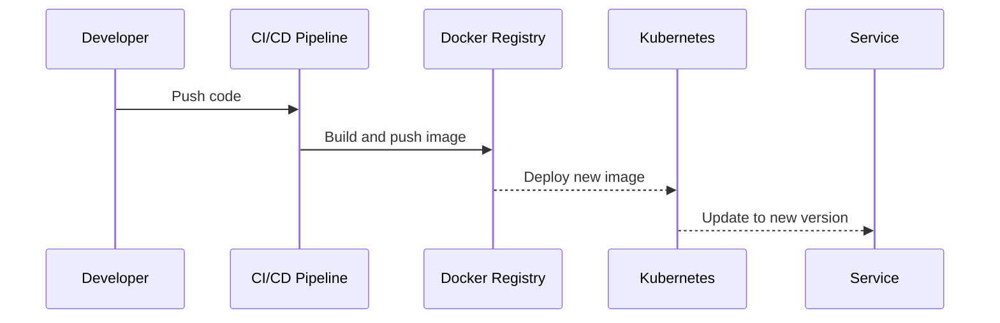

Refactoring a bulky, intertwined Node.js monolith into sleek, efficient NestJS microservices is akin to untangling a giant knot. It's a daunting task that demands patience, precision, and a keen eye for detail. In this deep dive, we'll navigate through the common pitfalls and highlight the strategies that ensure a smooth transition. We're not just scratching the surface; we're delving into the nitty-gritty details that most guides gloss over. From identifying service boundaries to managing deployment and observability, I'll share insights on making refactoring a success in the real world.

## Identifying Service Boundaries in Legacy Code

The first step in dismantling a monolith is identifying logical service boundaries. This process involves analyzing business capabilities, data flow, and dependencies within your application. Here are a few practical steps:

- **Conduct a domain-driven design (DDD) workshop:** Involve stakeholders and developers to map out the domain model of your application.
- **Analyze database schemas and access patterns:** Look for natural separations in data that could indicate service boundaries.
- **Trace request paths:** Understanding how requests flow through your application can reveal tightly coupled components that should be separated.

### Incremental Refactoring vs Rewrite Debates

Jumping straight into a complete rewrite is tempting but often unrealistic. Incremental refactoring allows you to gradually transition to microservices while maintaining functionality. Here's why it's usually the better approach:

- **Risk management:** Smaller changes are easier to handle and roll back if something goes wrong.
- **Continuous delivery:** You can keep delivering new features and fixes without halting development for a big-bang release.
- **Learning curve:** Your team can gradually adapt to the new architecture and technologies.

## Setting Up Communication with NestJS Microservices

Communication between microservices is a critical aspect of your architecture. NestJS provides a robust framework for building microservices with various transport strategies, including HTTP, gRPC, and message brokers like Kafka or RabbitMQ. Let's dive into an example using message brokers:

```ts filename="microservice-communication.ts"
import { ClientProxyFactory, Transport } from '@nestjs/microservices';

const client = ClientProxyFactory.create({
  transport: Transport.KAFKA,
  options: {
    client: {
      clientId: 'hero',
      brokers: ['localhost:9092'],
    },
    consumer: {
      groupId: 'hero-consumer'
    }
  }
});

async function publishEvent() {
  await client.emit('hero.created', { id: 1, name: 'Batman' });
}
```

In this example, we're setting up a NestJS app to publish an event to a Kafka topic. This approach decouples services, allowing them to communicate asynchronously and scale independently.

## State Management and Database per Service

Adopting a database per service is crucial for true microservice independence. This approach eliminates tight coupling at the database level, enabling services to evolve independently. Considerations include:

- **Schema management:** Each service owns its schema and data model.
- **Data duplication:** Some data might be duplicated across services, requiring synchronization mechanisms.
- **Cross-service queries:** Solve this challenge with API composition or by implementing a CQRS pattern.

## Testing Strategy for Distributed Services

Testing becomes more complex in a microservices architecture. You'll need a strategy that includes:

- **Unit testing:** Testing individual components in isolation.
- **Integration testing:** Testing interactions between components or services.
- **End-to-end testing:** Testing the entire system from the user's perspective.

### Test Mocks for Inter-Service Calls

When testing a service that depends on another, mocking inter-service calls is essential. Here's a simple example:

```ts filename="service-test.mock.ts"
jest.mock('./hero.service', () => ({
  getHero: jest.fn().mockResolvedValue({ id: 1, name: 'Batman' }),
}));
```

This mock replaces the real `getHero` service call with a resolved promise, simplifying testing by isolating the service under test.

## Managing Deployment and Observability

Deploying and monitoring microservices introduces new challenges, particularly around service discovery, configuration management, and observability. Tools like Kubernetes for orchestration, Consul for service discovery, and Prometheus and Grafana for monitoring can manage these aspects effectively.

Deploying with Docker and Kubernetes simplifies scaling and managing service lifecycles. For observability, implementing centralized logging with ELK (Elasticsearch, Logstash, Kibana) and distributed tracing with Jaeger or Zipkin provides deep insights into your microservices' health and performance.

**Mermaid Sequence Diagram for a Simple Deployment Process:**



This diagram illustrates the basic flow from code push to service update, highlighting the automated steps in a modern CI/CD pipeline.

Refactoring from a monolith to microservices is never a "one size fits all" endeavor. It requires a bespoke approach that considers the unique aspects of your legacy system and business needs. However, with the right strategy, incremental changes, and a focus on quality and testing, the transition can lead to a more scalable, maintainable architecture.

Until next time, happy coding 👨‍💻  
– Patricio Marroquin 💜
