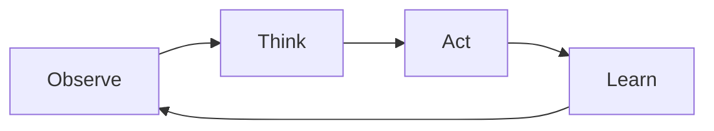

As we step into 2026, the frontier of AI is not just about making machines that can understand and converse with us; it's about building agents that can act autonomously, complete complex tasks, and even use tools. This is a huge leap from the chatbots we've been accustomed to. With Node.js, OpenAI, and Anthropic's APIs at our disposal, creating agentic AI applications has never been more accessible. This tutorial will guide you through building these intelligent agents, focusing on tool use, managing multi-step tasks, and ensuring safety through guardrails.

## What Makes an AI Agent Different from a Chatbot

At its core, a chatbot responds to user inputs with pre-defined or dynamically generated responses. It's a reactive model. An AI agent, however, is proactive. It:

- Observes its environment
- Processes the information (thinks)
- Acts upon the environment
- Learns from the outcome

This loop enables AI agents to execute tasks autonomously, use tools, and adapt to new challenges.

## The Agent Loop: Observe, Think, Act, Repeat

The essence of an agentic AI is its continuous loop of observation, thought, action, and learning. Implementing this in Node.js requires a nuanced approach to programming, where the agent must manage states, interpret data, and make decisions.



This loop is the backbone of our AI agent, guiding its decision-making process and actions.

## Implementing Tool Use with OpenAI's Function Calling

OpenAI offers an API that allows AI models to call functions, enabling them to perform actions like making API requests or querying databases. Here's a basic implementation in TypeScript:

```ts filename="agentLoop.ts"
import { OpenAI } from 'openai';

const openai = new OpenAI(process.env.OPENAI_API_KEY);

async function performTask(description: string) {
  const response = await openai.createCompletion({
    model: 'text-davinci-003',
    prompt: `Please complete the following task: ${description}`,
    temperature: 0.5,
    max_tokens: 100,
    top_p: 1.0,
    frequency_penalty: 0.0,
    presence_penalty: 0.0,
    function_calls: true,
  });

  console.log(response.choices[0].text);
}
```

This snippet demonstrates how to request OpenAI's API to execute a task described by `description`, enabling tool use within the AI's capabilities.

## Implementing Tool Use with Anthropic's tool_use Feature

Anthropic's API introduces a `tool_use` feature, which, akin to OpenAI's function calling, allows AI to interact with external tools and APIs. While the specifics of the API might evolve, the conceptual implementation remains consistent:

```ts filename="anthropicToolUse.ts"
// Pseudocode for illustrative purposes
import { AnthropicAPI } from 'anthropic';

const anthropic = new AnthropicAPI(process.env.ANTHROPIC_API_KEY);

async function executeToolUse(description: string) {
  const tools = defineToolsForTheTask(); // Define your tools here
  const response = await anthropic.performTaskWithTools(description, tools);

  console.log(response.result);
}
```

Here, `defineToolsForTheTask` would be a function where you specify the tools the AI can use, based on the task's requirements.

## Building Guardrails: Limiting Scope and Requiring Confirmation

One of the critical aspects of deploying agentic AI is ensuring they operate within safe boundaries. This includes:

- **Limiting the scope** of what the AI can do, such as restricting API calls or database queries.
- **Requiring confirmation** for actions that could have significant consequences.

Implementing confirmation middleware in Node.js could look something like this:

```ts filename="confirmationMiddleware.ts"
async function confirmationMiddleware(request, response, next) {
  if (request.needsConfirmation) {
    // Send confirmation request to the administrator
    const confirmed = await getConfirmationFromAdmin(request);
    if (!confirmed) {
      return response.status(403).send('Action not confirmed');
    }
  }
  next();
}
```

This middleware checks if an action needs confirmation and halts the process until an administrator approves it.

## Handling Multi-Step Tasks with Memory and State

For AI agents to handle complex, multi-step tasks, they need a way to remember previous interactions and maintain state. Using Redis as a session store is an effective solution:

```ts filename="sessionManagement.ts"
import { createClient } from 'redis';

const client = createClient();

async function storeSessionData(sessionId: string, data: any) {
  await client.set(sessionId, JSON.stringify(data));
}

async function retrieveSessionData(sessionId: string) {
  const data = await client.get(sessionId);
  return JSON.parse(data);
}
```

This enables the AI to pick up where it left off, ensuring continuity across tasks.

## Error Recovery and Graceful Degradation

Errors are inevitable, especially in complex systems. Implementing robust error handling and recovery mechanisms ensures that the AI can degrade gracefully, resorting to manual intervention only when absolutely necessary.

```ts filename="errorHandling.ts"
try {
  // Attempt to perform a task
} catch (error) {
  logError(error);
  notifyAdministrator(error);
  // Attempt recovery or mitigation strategies
}
```

This pattern allows the system to alert administrators while trying to resolve the issue autonomously.

## Production Deployment: Logging, Monitoring, and Cost Control

Deploying an AI agent in production requires careful consideration of logging, monitoring, and cost management. Here's a basic framework for tracking API usage and costs:

```ts filename="costTracking.ts"
import { logUsage } from './logger';

async function trackAPICall(apiName: string) {
  const cost = calculateCost(apiName); // Define cost calculation logic
  logUsage({ apiName, cost });
  // Implement budget enforcement logic
}
```

This ensures you can keep tabs on the operation of your AI agent, making adjustments as needed to stay within budget and operational parameters.

In conclusion, building agentic AI applications with Node.js is a fascinating journey into the future of software development. By leveraging APIs from OpenAI and Anthropic, and implementing solid guardrails and state management, we can create intelligent agents that perform tasks autonomously, enhance productivity, and push the boundaries of what's possible with AI.

Until next time, happy coding 👨‍💻  
– Patricio Marroquin 💜
