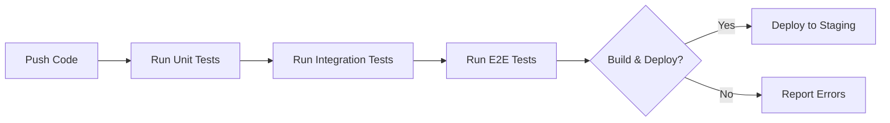

Testing microservices in a NestJS ecosystem can seem like a daunting task. The complexity of microservices architecture, coupled with the dynamic nature of NestJS, can make even the most seasoned developers think twice before diving into test development. However, with a structured approach and the right tools, creating reliable tests for your NestJS microservices doesn't have to be a nightmare. In this article, we'll explore practical steps and strategies to write maintainable unit, integration, and end-to-end tests that can be seamlessly integrated into real project workflows and automation pipelines. So, buckle up, and let's make testing less of a chore and more of a streamlined part of your development process.

## Test Pyramid Explained for Microservices

The test pyramid is a concept that helps developers strategize their testing approach by categorizing tests into different levels based on their scope and speed. In the context of microservices, this pyramid takes on even greater significance due to the distributed nature of the system.

1. **Unit Tests**: These are quick, isolated tests that cover individual components or functions.
2. **Integration Tests**: These tests check the interaction between different modules or services.
3. **End-to-End (E2E) Tests**: Simulate real-user scenarios across the entire application, including all services and databases.

Understanding how to apply these levels efficiently in a microservices architecture is key to a robust testing strategy.

## Unit Testing Controllers and Services with Jest

NestJS leverages Jest as its default testing framework, providing a powerful and efficient way to write tests for your services and controllers.

```ts filename="cats.service.spec.ts"
import { CatsService } from './cats.service';
import { Test, TestingModule } from '@nestjs/testing';

describe('CatsService', () => {
  let service: CatsService;

  beforeEach(async () => {
    const module: TestingModule = await Test.createTestingModule({
      providers: [CatsService],
    }).compile();

    service = module.get<CatsService>(CatsService);
  });

  it('should return expected cat', async () => {
    const expectedCat = { name: 'Tom', age: 5 };
    jest.spyOn(service, 'findOne').mockImplementation(() => Promise.resolve(expectedCat));
    expect(await service.findOne('a-unique-id')).toEqual(expectedCat);
  });
});
```

This example demonstrates a basic unit test for a service in NestJS, mocking dependencies to isolate the service's functionality.

## Mocking Inter-Service Communication

Inter-service communication is a critical part of microservices architecture. For testing, mocking these interactions is essential to isolate the service under test.

```ts filename="inter-service-client.mock.ts"
class InterServiceClientMock {
  send(pattern: string, data: any) {
    // Mock response based on the pattern and data
    if (pattern === 'get_user') {
      return Promise.resolve({ id: 1, name: 'John Doe' });
    }
    // Add more patterns and mock responses as needed
  }
}
```

This mocked transport layer allows you to simulate inter-service calls without needing the actual services to be up and running.

## Integration and End-to-End Test Approaches

While unit tests focus on the individual parts, integration and E2E tests ensure that those parts work together as expected.

### Integration Testing

Integration tests in a NestJS microservices context often involve testing the application's interaction with databases and other services.

```ts filename="users.e2e-spec.ts"
import { Test, TestingModule } from '@nestjs/testing';
import { INestApplication } from '@nestjs/common';
import { UsersModule } from '../src/users/users.module';

describe('UsersModule (e2e)', () => {
  let app: INestApplication;

  beforeEach(async () => {
    const moduleFixture: TestingModule = await Test.createTestingModule({
      imports: [UsersModule],
    }).compile();

    app = moduleFixture.createNestApplication();
    await app.init();
  });

  it('/GET users', () => {
    return request(app.getHttpServer())
      .get('/users')
      .expect(200)
      .expect([
        { id: 1, name: 'John Doe' },
        // Expected users
      ]);
  });
});
```

### End-to-End Testing

For E2E testing, simulating real-world scenarios across all services is crucial. This involves testing from the user's perspective, ensuring that the entire system functions as intended.

```ts filename="app.e2e-spec.ts"
// Pseudocode example to illustrate the concept
describe('App (e2e)', () => {
  it('completes a user registration flow', async () => {
    // Step 1: User signs up
    // Step 2: User receives confirmation email
    // Step 3: User confirms email
    // Verify final outcome: User is able to log in with the new account
  });
});
```

## Setting Up CI Pipelines with Tests

Automating your tests through Continuous Integration (CI) pipelines ensures that your tests are run consistently and results are reported back to the team. A simple CI pipeline for a NestJS microservices project might look like this:



This pipeline ensures that code changes are thoroughly tested before being deployed, reducing the likelihood of bugs making it to production.

## Dealing with Flaky Tests and Debugging Tips

Flaky tests can undermine the confidence in your testing suite. Here are some strategies to deal with them:

- **Isolate the test environment**: Ensure that external factors do not influence your test outcomes.
- **Use explicit waits rather than timeouts** in your E2E tests to handle asynchronous operations more predictably.
- **Review test logs and outputs** carefully to understand why a test might be flaky.

In conclusion, testing NestJS microservices effectively requires a balanced approach across unit, integration, and E2E tests, along with the right mocking strategies for inter-service communication. By integrating these tests into your CI pipelines, you can ensure that your microservices are tested automatically and reliably. Remember, the goal is not just to have a suite of tests but to have a suite that provides value and confidence in your software delivery process.

Until next time, happy coding 👨‍💻  
– Patricio Marroquin 💜
